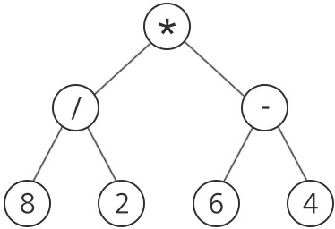
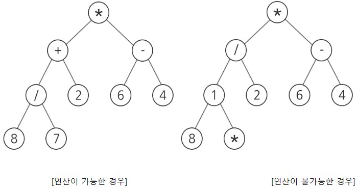
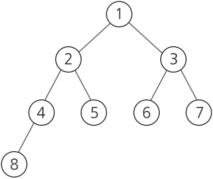

# [1233. 사칙연산 유효성 검사](https://swexpertacademy.com/main/code/problem/problemDetail.do?contestProbId=AV141176AIwCFAYD&)

- 시간 : 10개 테스트케이스를 합쳐서 C++의 경우 10초 / Java의 경우 20초 / Python의 경우 30초
- 메모리 : 힙, 정적 메모리 합쳐서 256MB 이내, 스택 메모리 1MB 이내

사칙연산으로 구성되어 있는 식은 이진 트리로 표현할 수 있다.
 
아래는 식 “(8/2)*(6-4)”을 이진 트리로 표현한 것이다.
 
임의의 정점에 연산자가 있으면 해당 연산자의 왼쪽 서브 트리의 결과와 오른쪽 서브 트리의 결과를 사용해서 해당 연산자를 적용한다.
 

 
사칙연산 “+, -, *, /”와 양의 정수로만 구성된 임의의 이진 트리가 주어질 때, 이 식의 유효성을 검사하는 프로그램을 작성하여라.
 
여기서 말하는 유효성이란, 사칙연산 “+, -, *, /”와 양의 정수로 구성된 임의의 식이 적절한 식인지를 확인하는 것으로, 계산이 가능하다면 “1”, 계산이 불가능할 경우 “0”을 출력한다.
 
(단, 계산이 가능한지가 아닌 유효성을 검사하는 문제이므로 0으로 나누는 경우는 고려하지 않는다. )
                                             

### [제약 사항]

총 10개의 테스트 케이스가 주어진다.
 
총 노드의 개수는 200개를 넘어가지 않는다.
 
트리는 완전 이진 트리 형식으로 주어지며, 노드당 하나의 연산자 또는 숫자만 저장할 수 있다.
 
노드는 아래 그림과 같은 숫자 번호대로 주어진다.
 

 
### [입력]

각 테스트 케이스의 첫 줄에는 각 케이스의 트리가 갖는 정점의 총 수 N(1≤N≤200)이 주어진다.
 
그 다음 N줄에 걸쳐 각각의 정점 정보가 주어진다.
 
해당 정점에 대한 정보는 해당 정점의 알파벳, 해당 정점의 왼쪽 자식, 오른쪽 자식의 정점번호가 차례대로 주어진다.
 
정점 번호는 1부터 N까지의 정수로 구분된다. 입력에서 정점 번호를 매기는 규칙은 위와 같으며, 루트 정점의 번호는 반드시 1이다.
 
입력에서 이웃한 숫자 또는 연산자, 자식 정점의 번호는 모두 공백으로 구분된다.
 
위의 예시에서, 숫자 8이 4번 정점에 해당하면 “4 8”으로 주어지고, 연산자 ‘/’가 2번 정점에 해당하면 두 자식이 각각 숫자 ‘8’인 4번 정점과 숫자 ‘2’인 5번 정점이므로 “2 / 4 5”로 주어진다.
 
총 10개의 테스트 케이스가 주어진다.

### [출력]

#부호와 함께 테스트 케이스의 번호를 출력하고, 공백 문자 후 테스트 케이스의 정답을 출력한다.