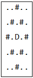
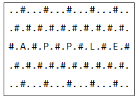

# [4751. 다솔이의 다이아몬드 장식](https://swexpertacademy.com/main/code/problem/problemDetail.do?problemLevel=3&contestProbId=AWSNw5jKzwMDFAUr&categoryId=AWSNw5jKzwMDFAUr&categoryType=CODE&problemTitle=&orderBy=PASS_RATE&selectCodeLang=PYTHON&select-1=3&pageSize=10&pageIndex=3&&&&&&&&&&)

- 시간 : 100개 테스트케이스를 합쳐서 C의 경우 1초 / C++의 경우 1초 / Java의 경우 2초 / Python의 경우 4초
- 메모리 : 힙, 정적 메모리 합쳐서 256MB 이내, 스택 메모리 1MB 이내

다솔이는 어떤 문자열을 하나 가지고 있는데, 이 문자열이 별로 아름답지 못하다고 생각하고 있다.
 
그래서 장식을 해주기로 했다.
 
예를 들어 문자열이 “D”라면 주위를 ‘#’로 이루어진 다이아몬드로 감싸서 다음과 같이 5x5크기로 장식한다.
 
빈 곳은 ‘.’로 표시한다.

만약 문자열의 길이가 1보다 더 크면, 인접한 문자는 ‘#’과 ‘.’을 공유하여 장식한다.
 
예를 들어 문자열이 “APPLE”이면 다음과 같이 장식한다.

주어진 문자열을 장식해주는 프로그램을 작성하라.

### [입력]

첫 번째 줄에 테스트 케이스의 수 T가 주어진다.
 
각 테스트 케이스의 첫 번째 줄에는 길이가 1이상 50이하인 문자열이 주어진다.

### [출력]

각 테스트 케이스마다 다섯 줄에 걸쳐 장식된 문자열을 출력한다.