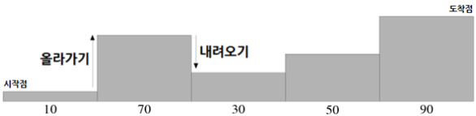

# [6730. 장애물 경주 난이도](https://swexpertacademy.com/main/code/problem/problemDetail.do?problemLevel=1&problemLevel=2&problemLevel=3&contestProbId=AWefy5x65PoDFAUh&categoryId=AWefy5x65PoDFAUh&categoryType=CODE&problemTitle=&orderBy=PASS_RATE&selectCodeLang=ALL&select-1=3&pageSize=10&pageIndex=2&problemLevel=1%2C2%2C3&&&&&&&&&)

 
- 시간 : 98개 테스트케이스를 합쳐서 C의 경우 1초 / C++의 경우 1초 / Java의 경우 2초
- 메모리 : 힙, 정적 메모리 합쳐서 256MB 이내, 스택 메모리 1MB 이내

참가자들은 가장 처음 블록 위에서 가장 마지막 블록의 위로 이동해야 한다.
 
이 프로그램을 보고 있던 준홍이는 심심해서 이 장애물 경주가 얼마나 어려울지 난이도를 매겨 보기로 했다.
 
참가자가 이동하는 도중에 다음 블록의 높이가 현재 블록의 높이보다 높다면 올라가야 할 것이고,
 
다음 블록의 높이가 낮다면 내려가야 할 것이다.
 
준홍이의 생각에 이 둘은 서로 다른 능력을 필요로 하므로,
 
주어진 장애물에서 올라갈 때의 높이 변화와 내려갈 때의 높이 변화 둘 각각에 대해
 
가장 높이 변화가 심한 부분을 난이도라 하기로 했다.

예를 들어 위와 같이 장애물이 서 있다고 하자. 밑에 적힌 수가 직사각형 블록의 높이이다.
 
이 때, 올라갈 때 가장 심한 높이 변화는 60이고 내려갈 때 가장 심한 높이 변화는 40이다.
 
그러므로 이 장애물 경주의 난이도는 60, 40이다.
 
장애물들이 주어질 때, 준홍이의 기준으로 난이도가 어떻게 매겨지는지 구하는 프로그램을 작성하라.

### [입력]

첫 번째 줄에 테스트 케이스의 수 T가 주어진다.
 
각 테스트 케이스의 첫 번째 줄에는 직사각형 블록의 개수를 나타내는 하나의 정수 N ( 2 ≤ N ≤ 100 )이 주어진다.
 
두 번째 줄에는 N개의 정수가 공백으로 구분되어 주어진다.
 
이는 직사각형 블록의 높이를 블록이 늘어선 순서대로 나타낸 것이다.
 
각 블록의 높이는 1이상 1,000이하이다.
 

### [출력]

각 테스트 케이스마다 ‘#x’(x는 테스트케이스 번호를 의미하며 1부터 시작한다)를 출력하고 한 칸을 띄운 후,
 
올라갈 때 가장 심한 높이 변화와 내려갈 때 가장 심한 높이 변화를 공백 하나로 구분하여 출력한다.
 
만약 올라가는 부분이나 내려가는 부분이 없다면, 0을 출력하면 된다.