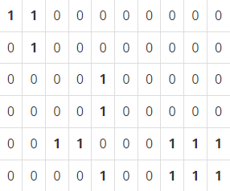

# [유기농 배추](https://www.acmicpc.net/problem/1012)
 
|시간 제한|메모리 제한|제출|정답|맞힌 사람|정답 비율|
| --- | --- | ---	| --- |	---	| --- |
|1 초	|512 MB	|143389	|56992	|38314	|37.617%|

### 문제
차세대 영농인 한나는 강원도 고랭지에서 유기농 배추를 재배하기로 하였다. 농약을 쓰지 않고 배추를 재배하려면 배추를 해충으로부터 보호하는 것이 중요하기 때문에, 한나는 해충 방지에 효과적인 배추흰지렁이를 구입하기로 결심한다. 이 지렁이는 배추근처에 서식하며 해충을 잡아 먹음으로써 배추를 보호한다. 특히, 어떤 배추에 배추흰지렁이가 한 마리라도 살고 있으면 이 지렁이는 인접한 다른 배추로 이동할 수 있어, 그 배추들 역시 해충으로부터 보호받을 수 있다. 한 배추의 상하좌우 네 방향에 다른 배추가 위치한 경우에 서로 인접해있는 것이다.
 
한나가 배추를 재배하는 땅은 고르지 못해서 배추를 군데군데 심어 놓았다. 배추들이 모여있는 곳에는 배추흰지렁이가 한 마리만 있으면 되므로 서로 인접해있는 배추들이 몇 군데에 퍼져있는지 조사하면 총 몇 마리의 지렁이가 필요한지 알 수 있다. 예를 들어 배추밭이 아래와 같이 구성되어 있으면 최소 5마리의 배추흰지렁이가 필요하다. 0은 배추가 심어져 있지 않은 땅이고, 1은 배추가 심어져 있는 땅을 나타낸다.

### 입력
입력의 첫 줄에는 테스트 케이스의 개수 T가 주어진다. 그 다음 줄부터 각각의 테스트 케이스에 대해 첫째 줄에는 배추를 심은 배추밭의 가로길이 M(1 ≤ M ≤ 50)과 세로길이 N(1 ≤ N ≤ 50), 그리고 배추가 심어져 있는 위치의 개수 K(1 ≤ K ≤ 2500)이 주어진다. 그 다음 K줄에는 배추의 위치 X(0 ≤ X ≤ M-1), Y(0 ≤ Y ≤ N-1)가 주어진다. 두 배추의 위치가 같은 경우는 없다.

### 출력
각 테스트 케이스에 대해 필요한 최소의 배추흰지렁이 마리 수를 출력한다.